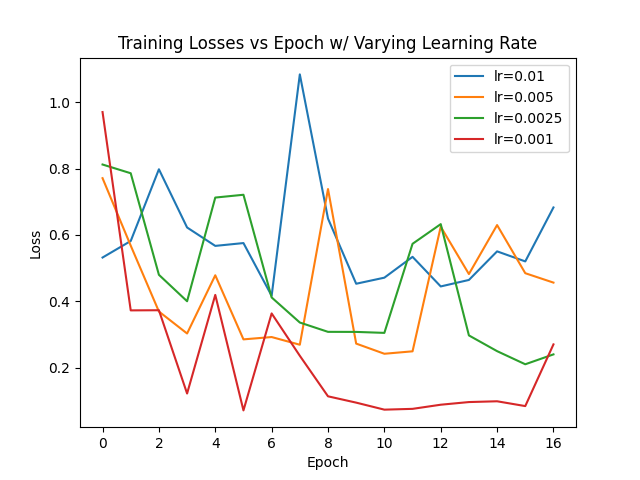
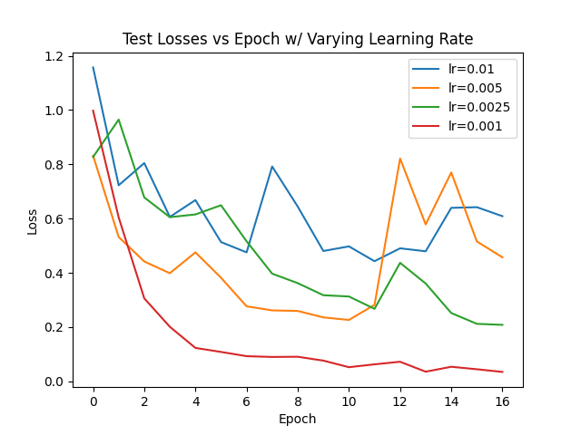
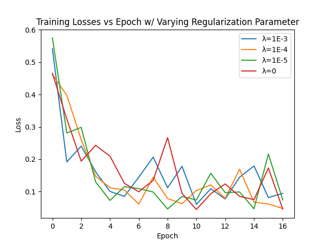
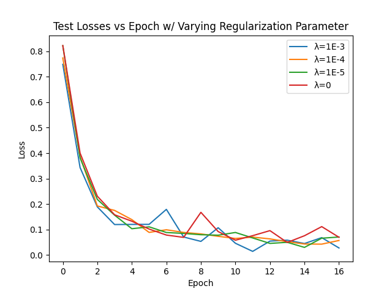
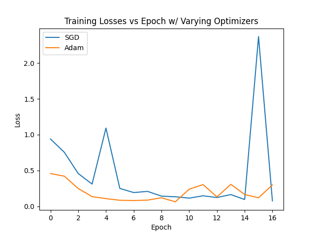
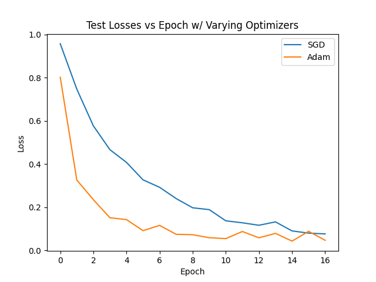

# Guava Disease Classifier

The project focuses on automating quality control in guava farming by detecting diseases like Anthracnose and fruit fly infestations. Manual inspection, the current standard, is slow, inconsistent, and unsuitable for large-scale operations. This often results in missed early detections, leading to financial losses and food waste.

Detecting diseases in guavas is challenging due to subtle and overlapping symptoms. Environmental factors like lighting, angles, and natural variations in guava appearance add complexity, making manual inspection unreliable and inefficient.

This project will compare three machine learning techniques—Convolutional Neural Networks (CNNs), Support Vector Machines (SVMs), and Random Forests—to determine the best approach for accuracy, efficiency, and reliability. By identifying an optimal method, we aim to reduce inspection times, improve food safety, and promote sustainable farming practices.

### Dataset
Kaggle Link: https://www.kaggle.com/datasets/asadullahgalib/guava-disease-dataset/data 

Original Source Link: https://data.mendeley.com/datasets/bkdkc4n835/1 

The dataset is a collection of 3784, 512x512 pixel 3 channel photos (augmented from the original set of 473) of guavas pre-split into training, testing and validation sets. Each image is labeled as one of: healthy, afflicted with fruit flies, or afflicted with Anthracnose. 

### Data Preprocessing

RGB data from the images was normalized to lie within (0, 1) from the original (0, 255).

### Feature Engineering

The dataset provided is already augmented via combinations of translation, rotation and resizing from a smaller set of images, so we will not be exploring additional augmentation for this iteration. For our RF and SVM models, which are unsuited to deal with the size of the feature set, we used the convolutional layers of our trained CNN model to reduce the feature set to a size of 128, from the original 512x512.

### Model Approaches

**CNN**: Our configuration used 4 convolutional layers, 4 pooling layers, and 4 fully connected layers. Cross-entropy loss was used as the loss function, and the model was trained for 15 epochs with a batch size of 10. Further details are available in the code. 

**Random Forest**: Our Random Forest model was trained using the features extracted from the pretrained CNN. The model was configured with 100 trees (n_estimators = 100) and a maximum depth of None, allowing each tree to grow fully. The Gini impurity was used as the splitting criterion. Cross-validation with 5 folds was performed to evaluate and tune hyperparameters, ensuring robust performance.

**SVM**: Our SVM model was also trained using the features extracted from the pretrained CNN model. The model used the RBF kernel with a regularization parameter C of 1.0. Standard scaling was applied to the features before training. 

### Improvements

Our original CNN, RF, and SVM models achieved an accuracy of 93.98%, 95.81%, and 94.28% respectively. The CNN model, which was the driver for all three, had a large variance in accuracy between epochs and runs, suggesting suboptimal hyperparameters, so we experimented with various learning rates, regularization parameters, and optimizers.

Our original model used a learning rate of 0.01. From our experimentation we reduced it to 0.001

Our original model had a regularization parameter of 0. Our testing was inconclusive on wwhat value wwould be best, but we chose 1E-5.

Our original model used pytorch's SGD optimizer. From our experimentation, we changed to Adam.

### Model Results
Making these new changes resulted in accuracy improvements for all three of our models, as they all depend on the CNN model. CNN accuracy increased from 93.98% to 98.12% due to architectural improvements. Random Forest accuracy improved from 95.81% to 98.56%, and SVM accuracy rose from 94.28% to 96.05%.

### Credits

Rafey Malik: Random Forest model
Rafik Manla Hassan: SVM model

